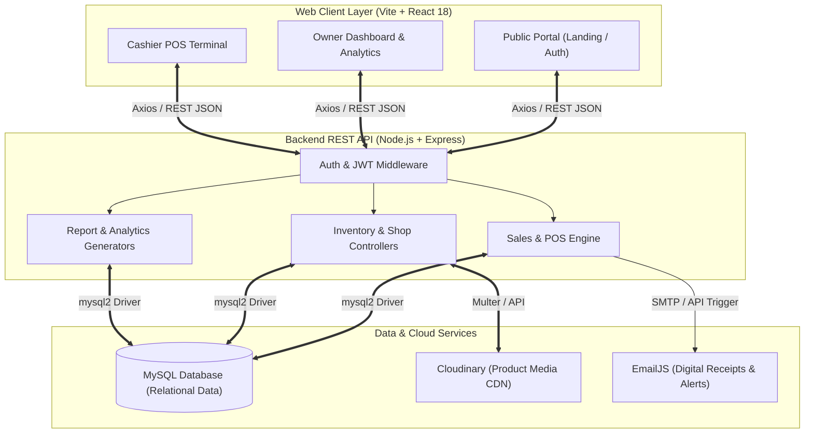
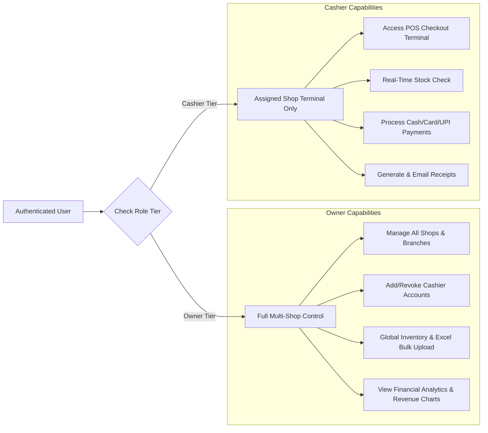
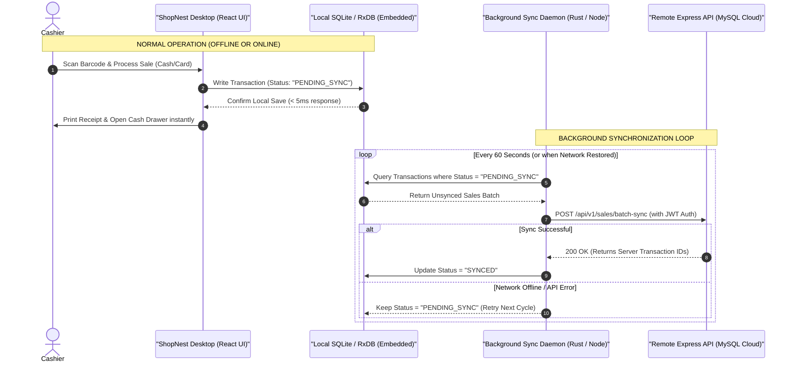
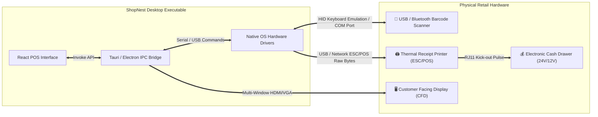

# 🏢 ShopNest: Full System Report & Desktop Transformation Roadmap

> [!IMPORTANT]
> **Executive Vision**: This document provides a complete, 360-degree breakdown of the **ShopNest Multi-Tenant Point of Sale (POS) System**, covering its existing web features, functional modules, and design architecture. Furthermore, it outlines an enterprise-grade **Desktop Software Transformation Roadmap**, analyzing technologies (Electron vs. Tauri vs. Native), offline-first data synchronization, and hardware peripheral integration (barcode scanners, thermal printers, cash drawers).

---

## 📑 Table of Contents
1. [Executive Summary & Current Architecture](#1-executive-summary--current-architecture)
2. [Comprehensive Feature & Functional Breakdown](#2-comprehensive-feature--functional-breakdown)
   - [Role-Based Access Control (RBAC)](#role-based-access-control-rbac)
   - [Core Functional Modules](#core-functional-modules)
   - [Security & Communication Protocols](#security--communication-protocols)
3. [UI/UX Design System & Aesthetic Architecture](#3-uiux-design-system--aesthetic-architecture)
4. [Desktop Software Transformation Strategy](#4-desktop-software-transformation-strategy)
   - [Why Transition to a Desktop POS?](#why-transition-to-a-desktop-pos)
   - [Technology Stack Evaluation (Electron vs. Tauri vs. .NET MAUI)](#technology-stack-evaluation-electron-vs-tauri-vs-net-maui)
   - [Offline-First & Local Database Sync Architecture](#offline-first--local-database-sync-architecture)
5. [Hardware Peripheral Integration Guide](#5-hardware-peripheral-integration-guide)
6. [Phased Implementation Roadmap](#6-phased-implementation-roadmap)

---

## 1. Executive Summary & Current Architecture

**ShopNest** is a multi-tenant retail solution engineered to streamline store management, inventory tracking, cashier point-of-sale transactions, and financial analytics. Currently implemented as a modern **Web Application**, it decouples a responsive client dashboard from a centralized RESTful API.

### Current Technology Stack Breakdown
| Layer | Technology | Primary Purpose |
| :--- | :--- | :--- |
| **Frontend Framework** | React 18 + Vite | High-performance Single Page Application (SPA) rendering with rapid HMR. |
| **Styling & UI Tokens** | Tailwind CSS + Lucide Icons | Responsive utility-first design system with curated iconography. |
| **State & Form Handling** | React Hook Form + Context API | Controlled form validations, error handling, and session state management. |
| **Data Visualization** | Recharts | Dynamic SVG charts for daily revenue, sales volume, and product performance. |
| **Backend Runtime** | Node.js + Express.js | Modular REST API routing, rate-limiting, and middleware request processing. |
| **Relational Database** | MySQL (`mysql2` pool) | ACID-compliant transactional storage for multi-shop schemas and inventory tables. |
| **File & Media Storage** | Cloudinary API + Multer | Cloud-based CDN storage for optimized product image hosting and transformation. |
| **Utility Integrations** | XLSX + EmailJS + Date-fns | Bulk Excel inventory import, automated receipt emailing, and date formatting. |

---

## 2. Comprehensive Feature & Functional Breakdown

### Role-Based Access Control (RBAC)
ShopNest implements strict multi-tenancy with distinct authorization tiers, ensuring complete data isolation across branches.

### Core Functional Modules

#### 1. Point of Sale (POS) & Transaction Engine (`PosTerminal.jsx`)
*   **Rapid Cart Management**: Instantaneous item addition via interactive product grids or barcode lookup simulation.
*   **Dynamic Calculation Engine**: Automated computation of item subtotals, configurable tax tiers (GST/VAT), discount applications, and final grand totals.
*   **Multi-Modal Payment Processing**: Seamless toggling between **Cash**, **Card**, and **UPI/Digital Wallets**, tracking tender amounts and change due.
*   **Automated Receipt Dispatching**: Integrated with **EmailJS** to instantly transmit digital itemized receipts to customer email addresses upon transaction completion.

#### 2. Advanced Inventory & Catalogue Mastery (`Inventory.jsx`, `StockCheck.jsx`)
*   **Bulk Catalogue Ingestion**: Features an **XLSX spreadsheet parsing engine** allowing store managers to upload hundreds of products, pricing tiers, and stock levels in a single operation.
*   **Cloud Media Hosting**: Automatically pushes uploaded product photos to **Cloudinary CDN**, generating optimized thumbnails that load instantly on cashier terminals.
*   **Low-Stock Alert Thresholds**: Proactive visual indicators and dashboard warnings when product quantities fall below defined minimum stock parameters.
*   **Centralized & Shop-Specific Stock**: Ability to transfer and track inventory across multiple physical store locations from a unified admin console.

#### 3. Analytics & Financial Intelligence (`OwnerDashboard.jsx`, `FinanceReports.jsx`)
*   **Visual Revenue Tracking**: Interactive Recharts time-series graphs displaying daily, weekly, and monthly gross revenue and profit margins.
*   **Best-Seller Matrix**: Automated identification of top-performing SKUs and high-velocity product categories.
*   **Tender Distribution Analysis**: Graphical breakdown of customer payment preferences (e.g., % Cash vs. % Card vs. % UPI).
*   **Exportable Financial Audits**: Capability to export granular transaction histories and accounting summaries into standard CSV/Excel formats.

### Security & Communication Protocols
> [!NOTE]
> Enterprise security is woven into every layer of ShopNest's REST backend, preventing unauthorized access and data leakage.

*   **Authentication**: JSON Web Token (JWT) architecture utilizing access tokens combined with secure refresh token rotation.
*   **Credential Protection**: All user passwords undergo multi-round **Bcrypt** cryptographic hashing prior to database persistence.
*   **Network & API Hardening**: 
    *   **Helmet.js**: Sets HTTP response headers to defend against Cross-Site Scripting (XSS), clickjacking, and packet sniffing.
    *   **Express Rate Limit**: Throttles brute-force attempts and denial-of-service (DoS) traffic on sensitive endpoints (e.g., login, registration).
    *   **CORS Configuration**: Restricts API execution exclusively to verified client origins.
*   **Payload Validation**: Rigorous schema checks using **Joi** and **Express-validator** to sanitize inputs and prevent SQL injection or corrupted data writes.

---

## 3. UI/UX Design System & Aesthetic Architecture

ShopNest follows modern web design principles to ensure high user engagement, visual hierarchy, and cashier efficiency.

### Design System Architecture
1.  **Color Palette & Theming**:
    *   **Primary Brand Tone**: Deep Indigo / Slate (`#3B82F6` to `#1E293B`) for professional trust and high contrast.
    *   **Action Indicators**: Emerald Green (`#10B981`) for successful checkouts/in-stock alerts; Crimson Red (`#EF4444`) for low-stock warnings and deletions.
    *   **Glassmorphism & Surface Elevation**: Uses translucent background overlays (`backdrop-blur-md`, `bg-white/80`, `bg-slate-900/90`) to create a floating card aesthetic that feels premium and state-of-the-art.
2.  **Typography & Scannability**:
    *   Built with geometric sans-serif typefaces (e.g., *Inter* or *Outfit* via Google Fonts) for legibility on both high-resolution desktop displays and compact touchscreen terminals.
    *   Monospaced numerical formatting for currency displays, receipt totals, and inventory counts to prevent layout shifting during real-time updates.
3.  **Component Hierarchy & Micro-Interactions**:
    *   **Lucide Iconography**: Consistent stroke-width icons providing immediate visual cues for navigation tabs, product categories, and action buttons.
    *   **Interactive Feedback**: Smooth hover animations, scale transitions on button press (`active:scale-95`), and instant toast notifications for cart actions and errors.
    *   **Responsive Layout Layouts**: Adaptive CSS grids that shift seamlessly from multi-column desktop layouts to consolidated single-column tablet views without losing functionality.

---

## 4. Desktop Software Transformation Strategy

Converting ShopNest from a browser-based web application into a **Dedicated Desktop Software Solution** is a strategic evolutionary step for retail deployments.

### Why Transition to a Desktop POS?
> [!TIP]
> A native desktop application bridges the gap between cloud management and physical retail hardware, delivering unmatched speed and reliability.

*   **Offline-First Resilience**: Physical retail stores cannot afford checkout halts during internet outages. A desktop app can continue processing sales locally and sync when back online.
*   **Direct Hardware Integration**: Browsers run in sandboxed environments that restrict direct communication with USB/Serial barcode scanners, receipt printers, and electronic cash drawers. Desktop apps bypass these browser restrictions.
*   **System Tray & Background Operation**: Ability to run background sync processes, display native OS notifications, and launch automatically upon operating system startup (kiosk mode).
*   **Enhanced Performance & Memory Control**: Removes browser tab overhead and allows dedicated memory allocation for large inventory catalogues.

### Technology Stack Evaluation (Electron vs. Tauri vs. .NET MAUI)

| Evaluation Criteria | Option A: Electron + React | Option B: Tauri + React *(Recommended)* | Option C: .NET MAUI / WPF (C#) |
| :--- | :--- | :--- | :--- |
| **Codebase Reuse** | **100% Reuse** of existing React/Vite/Tailwind frontend code. | **100% Reuse** of existing React/Vite/Tailwind frontend code. | **0% Reuse** (Requires full rewrite in C#/XAML). |
| **Runtime Architecture** | Bundles Chromium + Node.js runtime inside the executable. | Uses OS native webview (Edge WebView2 on Windows) + Rust backend. | Native C# / .NET compiled runtime. |
| **Installer Binary Size** | Large (~120 MB – 150 MB). | **Ultra-Lightweight (~8 MB – 15 MB)**. | Medium (~30 MB – 60 MB). |
| **RAM & CPU Overhead** | Moderate to High (~150 MB – 300 MB RAM baseline). | **Extremely Low (~30 MB – 50 MB RAM baseline)**. | Low to Moderate (~50 MB – 100 MB RAM). |
| **Hardware / OS Access** | Excellent via Node.js native modules (`serialport`, `usb`, `escpos`). | **Superior & Secure** via Rust system crates and custom commands. | Industry standard for legacy Windows retail hardware. |
| **Development Speed** | **Fastest** (Can be wrapped in a few days). | **Fast** (Requires basic Rust configuration for OS commands). | Slowest (Complete rebuild required). |
| **Security Sandbox** | Vulnerable if IPC IPC communication is misconfigured. | **Enterprise Grade** (Strict capabilities and Rust memory safety). | High native OS security. |

#### 🏆 Recommendation: Tauri (v2) + React / Vite
For ShopNest, **Tauri v2** is the absolute best choice. It allows you to keep **100% of your current React, Vite, and Tailwind CSS UI**, while compiling down to a lightning-fast, ultra-secure Windows `.exe` / macOS `.app` that consumes a fraction of the memory of Electron.

---

### Offline-First & Local Database Sync Architecture

To make ShopNest function seamlessly without internet, the desktop application must implement an **Offline-First Synchronization Engine** combining a local embedded database with the remote MySQL cloud server.

#### Local Database Selection for Desktop
1.  **SQLite (via `tauri-plugin-sql` or `better-sqlite3`)**:
    *   The industry standard for desktop offline storage.
    *   Stores a mirrored copy of products, categories, pricing, and cashier profiles locally on the hard drive.
2.  **Conflict Resolution Protocol (Last-Write-Wins vs. Append-Only)**:
    *   **Sales Transactions**: Treated as *append-only immutable logs*. Offline sales are assigned a UUID v4 on the desktop terminal and pushed sequentially to the cloud without primary key collisions.
    *   **Inventory Quantities**: The server acts as the source of truth. When online, the desktop app deducts local stock immediately and pushes delta subtractions (`-1 item`) rather than absolute totals to prevent race conditions across multiple terminals.

---

## 5. Hardware Peripheral Integration Guide

Converting to a desktop software unlocks native integration with standard point-of-sale retail peripherals.

### 1. Barcode Scanner Integration
*   **Mode A: HID Keyboard Emulation (Plug & Play)**: Most USB scanners emulate a keyboard. When a barcode is scanned, it types the SKU digits into the active input field followed by an `<Enter>` keypress. In ShopNest, implement an automated global window listener in React that captures rapid alphanumeric input streams ending in `Enter` and automatically triggers the product lookup function.
*   **Mode B: Virtual Serial Port (COM Port / RS-232)**: For industrial scanners, connect directly via Node's `serialport` library or Tauri's serial plugin. This allows background scanning even when the search input box is not actively focused!

### 2. Thermal Receipt Printer & Cash Drawer (ESC/POS)
*   **Protocol**: Direct communication using the **ESC/POS command set** (Epson standard for POS printers).
*   **Receipt Formatting**: Instead of relying on browser window printing (`window.print()`), generate raw binary commands for:
    *   Bold text, text centering, and font sizing.
    *   Printing QR codes / Barcodes directly on paper thermal rolls (58mm or 80mm).
    *   Cutting paper rolls automatically at the end of a transaction (`GS V` command).
*   **Cash Drawer Triggering**: Cash drawers are connected directly to the back of the thermal printer via an **RJ11/RJ12 telephone cable**. Sending the specific ESC/POS kick-out byte sequence (`ESC p 0 25 250`) to the printer automatically opens the physical cash drawer upon cash tender completion!

---

## 6. Phased Implementation Roadmap

To successfully transform the ShopNest web app into an enterprise desktop software, execute the following phased development plan:

### Phase 1: Environment Packaging & Desktop Wrapper (Weeks 1–2)
*   [x] Initialize a new **Tauri v2** (or Electron) project wrapper inside the ShopNest root repository (`/desktop` directory) or dedicated workspace.
*   [x] Configure Vite build settings (`vite.config.js`) to export static production assets (`dist/`) directly into the desktop webview container.
*   [x] Set up custom window styling: remove default browser borders, implement custom window drag regions, minimize/maximize buttons, and fullscreen kiosk mode toggles.
*   [x] Establish secure IPC (Inter-Process Communication) bridges between the React frontend and desktop background process.

### Phase 2: Offline SQLite Embedded Layer & Sync Engine (Weeks 3–5)
*   [x] Integrate `tauri-plugin-sql` (SQLite) to initialize a local database schema on client startup.
*   [x] Write automated data migration scripts that mirror MySQL product and shop tables into local SQLite storage.
*   [x] Build the background synchronization loop in the desktop layer:
    *   Network status monitoring (`navigator.onLine` paired with ping checks to the backend API).
    *   Queueing offline transactions into a local `pending_sales` table.
    *   Batch-uploading queued records once cloud connectivity is restored.

### Phase 3: Hardware Peripherals & Print Engine (Weeks 6–7)
*   [x] Implement a native ESC/POS thermal printing module using Rust (`escpos-rs`) or Node (`node-escpos`).
*   [x] Build a custom "Printer Configuration" settings modal in the Owner/Cashier UI to select active USB/Network printer ports (e.g., `COM3`, `/dev/usb/lp0`, or IP `192.168.1.50`).
*   [x] Connect RJ11 cash drawer trigger commands to the "Cash Payment Received" action in `PosTerminal.jsx`.
*   [x] Add global serial barcode scanning listeners to bypass manual form focusing.

### Phase 4: Packaging, Auto-Updates & Security Hardening (Weeks 8–9)
*   [x] Configure build pipelines (GitHub Actions / CI/CD) to compile native installers:
    *   **Windows**: `.exe` Setup Wizard and `.msi` enterprise packages.
    *   **macOS**: Universal `.dmg` and `.app` bundles (Intel & Apple Silicon).
*   [x] Implement **Tauri Updater** / **electron-updater**: Allow the desktop application to automatically check for new GitHub releases and install silent background updates.
*   [x] Hard-code API cryptographic keys into compiled desktop binaries and apply code signing certificates to prevent antivirus false-positives.

---

## 💡 Conclusion & Next Steps

ShopNest is already a feature-rich, visually stunning multi-tenant POS web application. By packaging its reactive React/Tailwind frontend with a **Tauri or Electron desktop runtime**, embedding an **offline SQLite sync layer**, and integrating **native ESC/POS hardware drivers**, ShopNest will transform into a commercial-grade, enterprise-ready turnkey Desktop Software capable of competing with industry leaders like Square, Vend, and Lightspeed.
